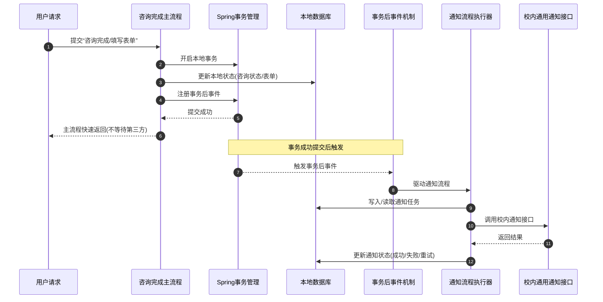
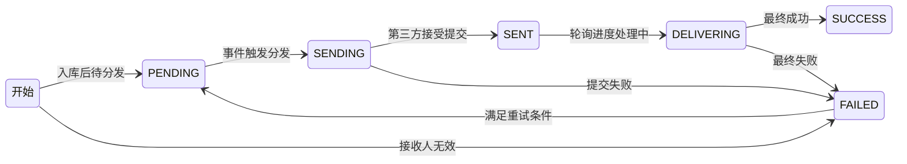

某校心理健康教育平台数字化系统距离上线只差临门一脚了（如果网信中心那边没有藏着的后续手续的话...），现在开始接入校内统一平台（其实是定制版企业微信）的通用消息通知接口。

由于这属于调用校内通用消息通知接口属于是调用第三方接口，如果放在业务里可能导致业务主流程响应变慢，所以我们设计了这样的事件流程：

原本测试中运行良好，可以正确的发送通知。
昨晚，由于心理中心老师的意见，我们修改了部分业务逻辑，由于业务较紧，人手不足，我们进行 `AI Coding` 来修改代码，然后人工进行测试和 `Code Review`。

在测试过程中，发生了统一通知无法发出的情况，检查数据库，发现对应消息的发送状态是 `PENDING`，以下是系统中消息发送的状态演进图：

观察发现，这些记录没有进入过 `SENDING` 等状态，说明：这些记录根本没有被分发，而是落库那一刻就 ‘死’ 了！

参考我们的业务时序：我们推断，事务后事件并没有被触发！导致对应的事件处理器没有办法从数据库中查询 `PENDING` 状态的记录，并进行发送和后续的状态演进！

既然已经确定是由于事件没有正常触发，那么思路就很清晰了，排查事件触发的逻辑链路。

<fieldset>
在讲解错误前，总结一下涉及到的 Spring 原理：

Spring 里可以把“发布事件”理解成一种应用内解耦通知机制。
比如：

A 模块做完一件事，但是不想直接把 B、C、D 模块都写死调用进去，就发布一个事件，谁关心，谁监听。

但是我们希望在事务提交后，也就是业务数据真正落库，再触发事件，
所以就不能使用一般的 `@EventListener`，因为 `@EventListener` 的特点是：

- 事件一发出去，就会被监听
- 默认是同步执行
- 发布者线程会直接调用监听器
- 它不关心事务是否提交

所以我们采用了 `@TransactionalEventListener(phase = TransactionPhase.AFTER_COMMIT)` ：则可以让监听器在事务完成提交时，才进行处理逻辑，也就符合了我们前面说期望的，业务数据落库了再处理。一个事务大致可以粗略理解成这样：
- 开启事务
- 执行业务 SQL
- 决定提交
- 真正 commit
- 触发提交后的回调
- 事务资源清理

而 `AFTER_COMMIT` 监听器执行的位置，大体就在：第 4 步之后，第 6 步之前/附近的事务同步回调阶段
</fieldset>

OK，回到项目的具体分析里：分析完整逻辑链路发现：现有的逻辑是：

业务逻辑中事务内发布消息 => 
业务消息 Listener 监听并发布统一消息 => 
真正调用通知接口的 Listener 接收并处理

问题就出现在了这里！！！

业务消息 Listener 是 `AFTER_COMMIT`，这很合理，因为需要保证业务逻辑中的事务正常提交完成。而由于代码结构变迁，真正调用通知接口的 Listener 还被错误的指定为 `AFTER_COMMIT`，而此时其监听的不再是业务逻辑中发布的消息了，而是业务消息 Listener 处理后再发出的消息，此时却没有事务了！没有事务，也就没办法真正执行这个处理！

将其改为一般的 `@EventListener`，问题解决👏
