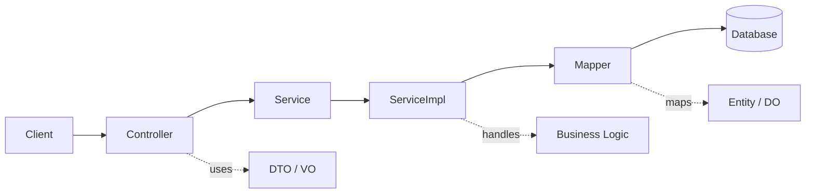
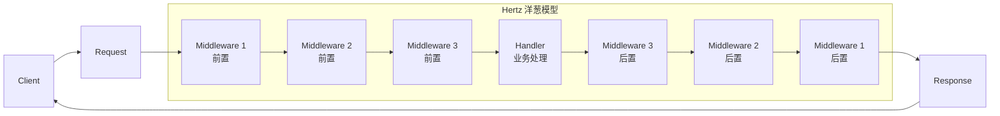

本人是长期使用 `Spring` 生态的 `Java/Kotlin` 选手，因为和宇宙厂有了些奇妙的关系，来学习一下 `Go` 和 `Hertz`，写篇博客阐述我的想法。

先放一个我总体的感受：`Spring Boot` 更像一个成熟的企业级应用平台；`Hertz` 更像一个轻量、高性能、显式可控的 HTTP 框架。

> **Spring Boot 的核心哲学是"框架接管复杂性"，Hertz 的核心哲学是"开发者显式组织复杂性"。**

---

## 同样是 Web 框架，为什么开发体验差异很大

Spring Boot 追求"少配置、少样板、框架自动完成大部分工作"，也就是我们说：`约定优于配置` （`Convention over Configuration`），在这个追求下，开发者只需要关注业务逻辑，框架和我们的插件（比如 `lombok`）会自动完成大部分配置和样板代码。

Hertz 追求"轻量、显式、开发者清楚掌握请求处理流程"。Hertz 框架只提供核心能力，比如路由注册、请求上下文、响应处理、中间件等等，而不是像 Spring Boot 那样提供大量的约定和自动配置。

比较这两个框架，首先要理解这种差异，理解二者在核心思想和设计哲学上的差异，才能更好地选择合适的框架。

---

## 应用平台 vs HTTP 服务骨架

### Spring Boot

Spring Boot 不是简单的 Web 框架，而是 Spring 生态的应用开发入口。
它通过 Starter、自动配置、IoC、AOP、事务、安全、监控等机制，为企业级应用提供完整工程能力。

它的思想是：**让开发者专注业务，框架负责装配和治理。**

### Hertz

Hertz 更接近一个高性能 HTTP 框架。
它关注路由、Handler、中间件、请求响应处理，以及和 `CloudWeGo` 微服务生态的结合。

它的思想是：**提供清晰、高性能的请求处理模型，让开发者按需组合能力。**

### 对比

Spring Boot 提供完整企业级应用体系，让开发者开箱即用，但是更像“带着镣铐舞蹈”；Hertz 提供轻量 HTTP 服务骨架，开发者可以高度自定义，实现更灵活的服务。

---

## 自动装配 vs 显式组合

### Spring Boot：约定优于配置

Spring Boot 的开发体验建立在"约定优于配置"和"自动配置"之上。
开发者通过注解声明 Controller、Service、Repository，框架通过容器自动扫描、创建和注入对象。

**关键词**：注解驱动、自动配置、IoC 容器、Starter 依赖、框架隐藏复杂性。

**开发体验**：写得少，启动快，生态能力容易接入；但框架背后做了很多事情，由于大量约定和风格的统一，新手可以快速上手写出像样的代码，但是有时不知道对象从哪里来、配置为什么生效、AOP 何时触发。

### Hertz：显式注册和组合

Hertz 的设计更强调显式性。
路由需要手动注册，中间件需要手动挂载，Handler 需要符合明确的函数签名，依赖关系通常由开发者自己构造。

**关键词**：显式路由、HandlerFunc、中间件链、RequestContext、手动依赖组合。

**开发体验**：流程清楚，控制感强，调用链直观；但工程能力需要自己组织，对于新手学习曲线较为陡峭，项目规范也需要团队自己建立，千人（团队）千面。

### 对比

一句话来说：Spring Boot 是"框架帮你组织应用"；Hertz 是"框架提供基础能力，你自己组织应用"。

---

## 声明式方法调用 vs 可控的处理链

### Spring Boot

在 Spring Boot 中，开发者通常面对的是 Controller 方法。
请求如何进入 DispatcherServlet、如何匹配方法、如何参数绑定、如何序列化返回值，大部分由框架完成。

```kotlin
@GetMapping("/users/{id}")
fun getById(@PathVariable id: Long): UserVO {
    return userService.getById(id)
}
```



这种体验是：**像是在写一个普通方法，框架负责把 HTTP 请求转成方法调用。**

Spring Boot 推荐的是 `Controller - Service - Mapper` 分层结构，其中 Controller 负责接收 HTTP 请求，Service 负责业务逻辑，Mapper 负责数据访问。分层由框架自动装配，依赖通过 `@Autowired` 或构造器注入传递，Mapper 接口则由框架在运行期自动生成代理实现。框架隐藏了很多底层细节，开发者只需要关注业务逻辑即可。

### Hertz

在 Hertz 中，请求处理更像是一条显式的 handler chain。
中间件和业务 Handler 都是 HandlerFunc，通过 `c.Next(ctx)`、`c.Abort()` 控制请求是否继续向后流动。

```go
api.GET("/users/:id", middleware.Auth(), userHandler.GetByID)
```



这种体验是：**开发者能清楚看到一个请求会经过哪些中间件，最后进入哪个业务 Handler。**

Hertz 本身不提供强制分层约定，但 Go 项目通常会显式组织为 `Handler - Service - Repository` 的结构，其中 Handler 负责接收 HTTP 请求和路由注册，Service 负责业务逻辑，Repository 负责数据访问。分层由开发者手动构建，依赖通过构造函数显式传递，没有框架自动装配，接口、实现和调用链一目了然，但项目规范需要团队自行约定。

### 对比

Spring Boot 把 HTTP 请求包装成 Controller 方法调用；Hertz 把 HTTP 请求暴露为一条可控的处理链。

---

## 便利性 vs 透明度

如果把二者放在“便利性”和“透明度”两个维度上看，Spring Boot 更偏向用框架能力换开发效率，而 Hertz 更偏向用显式控制换链路清晰。

### 开发便利性

| 维度 | Spring Boot | Hertz |
| --- | --- | --- |
| 项目启动 | 自动配置多，开箱即用能力强 | 需要手动组织路由、中间件和依赖 |
| 常见能力 | 数据访问、事务、安全、监控等能力集成方便 | 框架核心轻，很多工程能力需要自己选型 |
| 团队规范 | Controller、Service、Mapper 等分层模式成熟 | 项目结构和开发规范需要团队自建 |
| 适用场景 | 适合复杂业务系统和企业级应用 | 适合高性能 HTTP 服务、网关、BFF、Go 微服务 |

### 透明度与控制权

| 维度 | Spring Boot | Hertz |
| --- | --- | --- |
| 请求链路 | HTTP 请求被包装成 Controller 方法调用 | 请求流程是一条显式的 handler chain |
| 扩展方式 | 通过 Bean、AOP、事务、拦截器等机制扩展 | 主要通过中间件和显式组合扩展 |
| 理解成本 | 抽象层多，自动配置和代理机制增加理解成本 | 模型轻量直接，中间件链路更容易看清 |
| 排查问题 | 需要理解框架生命周期和内部机制 | 行为更直接，但组织复杂性的责任更多交给开发者 |

所以 Spring Boot 不是“不透明”，而是把大量复杂性封装进框架；Hertz 也不是“不方便”，而是把组织复杂性的责任更多交还给开发者。

---

## 结语

选择 Spring Boot，更多是在选择成熟生态和框架托管能力；
选择 Hertz，更多是在选择轻量模型、显式控制和 Go 式工程风格。

二者不是谁取代谁，而是代表两种不同的后端开发哲学：

> **Spring Boot 用框架能力换开发便利；Hertz 用显式控制换透明度和灵活性。**
