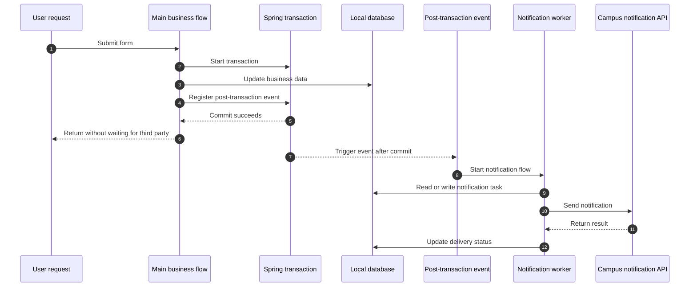
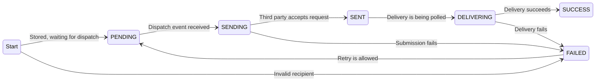

## Notifications should not slow down the main request

A campus mental-health platform was nearly ready to launch, and we were integrating its general notification API with the university platform. Calling that third-party API inside the business flow could make requests noticeably slower, so we designed an event-driven flow:



The flow worked in testing. After a late business change, we used AI-assisted coding to modify the implementation and then reviewed and tested the result manually.

## Messages became stuck in PENDING

Some notifications suddenly stopped being delivered. Their database records remained in `PENDING` and never entered `SENDING`, which meant they had been saved but never dispatched.



The most likely explanation was that the post-transaction event had never fired, so the handler could not find and send those records.

## A quick refresher on Spring transaction events

Spring application events decouple modules: one module publishes an event instead of calling every interested module directly.

A regular `@EventListener` runs synchronously when the event is published and does not care whether the surrounding transaction eventually commits. We therefore used:

```java
@TransactionalEventListener(phase = TransactionPhase.AFTER_COMMIT)
```

That listener runs after the business transaction has committed, when its data is safely stored.

## The AFTER_COMMIT event was nested

The full chain looked like this:

1. Business code published a domain event inside a transaction.
2. A domain-event listener received it and published a general notification event.
3. A second listener received the notification event and called the notification API.

The first listener correctly used `AFTER_COMMIT`. During an earlier structural refactor, however, the second listener had also been left as `AFTER_COMMIT`.

## The second listener must not wait for another transaction

By the time the first `AFTER_COMMIT` listener published the second event, the original transaction had already committed. There was no new transaction for the second listener to wait on, so it never ran.

Changing the second listener to a regular `@EventListener` fixed the problem. The useful rule is simple: only the event that truly depends on a successful commit should use `AFTER_COMMIT`; an event published from that callback should not blindly inherit the same phase.
