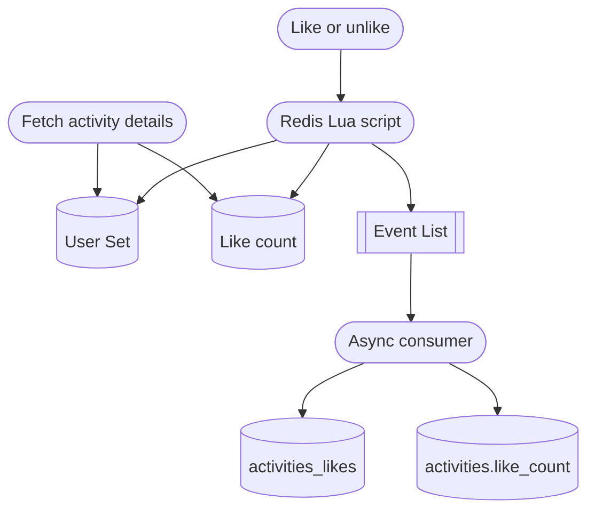

## The like cache

One campus system has a frequently written “like” feature. Redis stores both the like count and the set of users who liked an activity. A Redis list acts as a lightweight queue that asynchronously persists those changes to the database.



## A fast follow-up request exposed the race

If the Lua script could not find the user set, the application loaded the data from the database and rebuilt the cache. Manual API testing looked correct.

The frontend, however, requested the latest details immediately after an unlike. The unlike endpoint correctly said that the user no longer liked the activity, but the next details request said that they still did—even after another refresh.

## An empty collection is not a cache miss

The failure occurred when the last like was removed. Redis deleted the now-empty set, so the next synchronous request interpreted the missing key as a cache miss. It rebuilt the set from the database before the asynchronous delete had been persisted, restoring stale data.

The cache model had confused two distinct states:

- the set has been cached and is intentionally empty;
- the set has never been cached or has expired.

## Keep a sentinel in an empty set

The fix was to insert a sentinel value whenever removing a user would otherwise empty the set. That keeps the key alive and prevents an accidental database fallback:

```java
private static final DefaultRedisScript<String> ACTIVITY_UNLIKE_SCRIPT =
        new DefaultRedisScript<>(
                "local existed = redis.call('SISMEMBER', KEYS[1], ARGV[1]) " +
                "local count = tonumber(redis.call('GET', KEYS[2]) or ARGV[4]) " +
                "if existed == 0 then return 'MISS:' .. count end " +
                "redis.call('SREM', KEYS[1], ARGV[1]) " +
                "if redis.call('SCARD', KEYS[1]) == 0 then redis.call('SADD', KEYS[1], ARGV[6]) end " +
                "redis.call('EXPIRE', KEYS[1], tonumber(ARGV[2])) " +
                "if count > 0 then count = redis.call('DECR', KEYS[2]) else count = 0 redis.call('SET', KEYS[2], '0', 'EX', tonumber(ARGV[3])) end " +
                "redis.call('EXPIRE', KEYS[2], tonumber(ARGV[3])) " +
                "redis.call('LPUSH', KEYS[3], ARGV[5]) " +
                "return 'OK:' .. count",
                String.class);
```

The broader lesson is that a missing cache key must not automatically mean “the source contains data.” Empty results often need an explicit representation.
