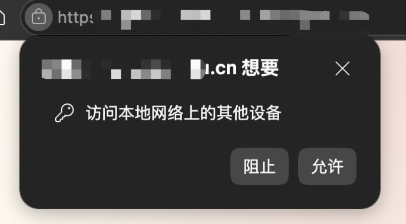
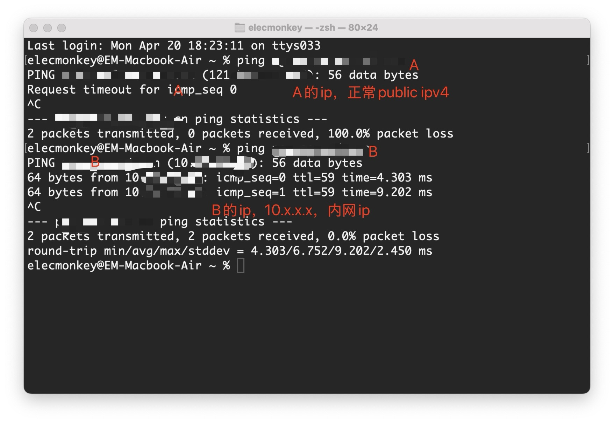

## The problem caused by PNA

### At launch: a warning that did not block anything

A temporary internal system had its frontend under a path on domain A and its backend under domain B. Both services were intended for intranet access, so the cross-origin deployment initially seemed harmless.

Chrome displayed a local-network warning when users entered the frontend:

At first, the prompt did not prevent the application from working, so it was easy to ignore.

### One week later: every request failed for some users

A week later, some users could no longer use the system. Every request failed to fetch, DevTools reported CORS errors, and the console mentioned Private Network Access.

The backend already returned the expected CORS headers. That forced a closer look at PNA itself.

## Why this network topology triggered PNA

### Domain A looked public to the browser

Domain A belonged to an older system that had once been publicly reachable. External access had since been blocked, but internal DNS still resolved it to the original public IP. Its “internal-only” status was therefore enforced by network filtering rather than by the address itself.

### Domain B was a conventional private host

Domain B resolved to a private IPv4 address. From Chrome's perspective, a page at a public address was requesting a private-network resource. PNA treated that as a public-to-private request and blocked it by default.

## Why the CORS solution was unreliable

### The theoretical answer: `Access-Control-Allow-Private-Network`

One suggested fix was to make Nginx add `Access-Control-Allow-Private-Network: true` to every `OPTIONS` response.

### What actually happened: Chrome asked the user

In this case Chrome did not consistently send the expected preflight. It displayed a permission prompt instead. A public source requesting a private host can certainly be risky, but the awkward question is who should grant permission: the user or the target server?

Extending CORS would let a target server explicitly authorize selected origins. Chrome instead moved toward a user-permission model, leaving server operators with less control over this deployment pattern.

## From PNA to LNA

- Early PNA versions in Chrome 94–123 used a CORS-based server authorization model.
- Chrome 124–141 introduced user permission prompts during the transition.
- From Chrome 142, Local Network Access centered the model on user permission and no longer depended on a preflight that could be satisfied with one extra response header.

The practical outcome was uncomfortable: users had to be told to allow the prompt. If they had already denied it, switching browsers was sometimes the quickest workaround; the embedded WeChat browser did not appear to block the request in the same way.
