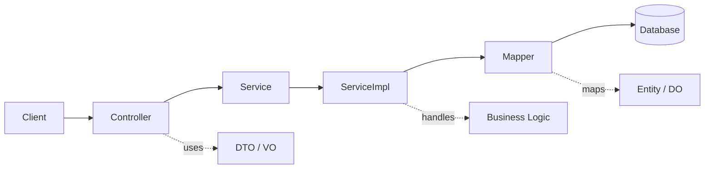
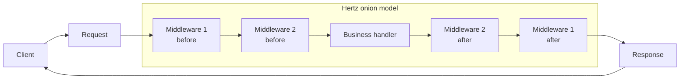

I have spent years in the Spring ecosystem as a Java and Kotlin developer. A new connection with ByteDance gave me a reason to learn Go and Hertz, so I wrote down my first comparison.

My overall impression is that **Spring Boot is a mature enterprise application platform**, while **Hertz is a lightweight, high-performance, explicitly controlled HTTP framework**.

> Spring Boot asks the framework to manage complexity. Hertz asks the developer to organize complexity explicitly.

## Why do two Web frameworks feel so different?

Spring Boot aims for little configuration and little boilerplate. Convention over configuration lets developers focus on business logic while the framework and supporting tools handle much of the assembly.

Hertz aims to stay lightweight and explicit. It supplies routing, request contexts, responses, and middleware, but does not impose the same volume of conventions and automatic configuration.

Understanding that philosophical difference is more useful than comparing isolated features.

## Application platform vs HTTP service skeleton

### Spring Boot

Spring Boot is not merely a Web framework. It is an entry point to the Spring application ecosystem. Starters, auto-configuration, IoC, AOP, transactions, security, and observability provide a complete engineering platform.

Its premise is: **developers focus on the business; the framework assembles and governs the application.**

### Hertz

Hertz is closer to a high-performance HTTP framework. It focuses on routes, handlers, middleware, request/response processing, and integration with the CloudWeGo microservice ecosystem.

Its premise is: **provide a clear, efficient request model and let developers compose the capabilities they need.**

### Comparison

Spring Boot offers a ready-made enterprise system with strong conventions. Hertz offers a smaller service skeleton that gives teams more freedom and more responsibility.

## Automatic assembly vs explicit composition

### Spring Boot: convention over configuration

Developers declare controllers, services, and repositories with annotations. The container scans, creates, and injects those objects.

The result is little code, rapid startup, and easy access to a large ecosystem. The trade-off is that newcomers may not know where an object came from, why a configuration activated, or when an AOP interceptor runs.

### Hertz: explicit registration and composition

Routes and middleware are registered manually, handlers follow a visible function signature, and dependencies are usually constructed by application code.

The request flow is clear and direct, but the team must organize engineering capabilities and establish its own project conventions.

In one sentence: Spring Boot organizes the application for you; Hertz gives you the primitives to organize it yourself.

## Declarative method calls vs a controllable handler chain

### Spring Boot

A Spring Boot developer usually works with a controller method:

```kotlin
@GetMapping("/users/{id}")
fun getById(@PathVariable id: Long): UserVO {
    return userService.getById(id)
}
```



The framework turns an HTTP request into what looks like an ordinary method call. It handles `DispatcherServlet`, route matching, parameter binding, and response serialization.

Spring projects commonly use `Controller → Service → Mapper`. Dependency injection connects the layers, and mapper implementations can be generated as runtime proxies. This keeps business code concise while hiding much of the underlying machinery.

### Hertz

Hertz exposes an explicit handler chain. Middleware and business handlers share the `HandlerFunc` model, and `c.Next(ctx)` or `c.Abort()` controls whether the request continues.

```go
api.GET("/users/:id", middleware.Auth(), userHandler.GetByID)
```



Developers can see which middleware a request traverses and which handler it eventually reaches.

Hertz does not enforce application layers, but Go services often use `Handler → Service → Repository`. Constructors pass dependencies explicitly. Interfaces, implementations, and the call graph stay visible, while conventions remain a team decision.

Spring Boot wraps HTTP as a controller method call. Hertz exposes HTTP as a controllable processing chain.

## Convenience vs transparency

### Development convenience

| Dimension | Spring Boot | Hertz |
| --- | --- | --- |
| Project setup | Rich auto-configuration and strong defaults | Routes, middleware, and dependencies need manual organization |
| Common capabilities | Data, transactions, security, and monitoring integrate easily | The core stays small; teams choose more of the surrounding stack |
| Team conventions | Mature Controller/Service/Mapper patterns | Structure and conventions are established by the team |
| Best fit | Complex business systems and enterprise applications | High-performance HTTP services, gateways, BFFs, and Go microservices |

### Transparency and control

| Dimension | Spring Boot | Hertz |
| --- | --- | --- |
| Request path | HTTP becomes a controller method invocation | The request travels through an explicit handler chain |
| Extension model | Beans, AOP, transactions, and interceptors | Middleware and explicit composition |
| Learning cost | More abstraction, auto-configuration, and proxies | A smaller direct model, but more application-level responsibility |
| Debugging | Requires knowledge of framework lifecycles | Behavior is direct, while architecture is the team's responsibility |

Spring Boot is not simply “opaque”; it packages complexity inside the framework. Hertz is not simply “inconvenient”; it returns responsibility for that complexity to developers.

## Conclusion

Choosing Spring Boot usually means choosing a mature ecosystem and framework-managed engineering capabilities. Choosing Hertz usually means choosing a lightweight model, explicit control, and Go-style composition.

Neither replaces the other. They represent different backend philosophies:

> Spring Boot trades framework power for convenience; Hertz trades explicit control for transparency and flexibility.
