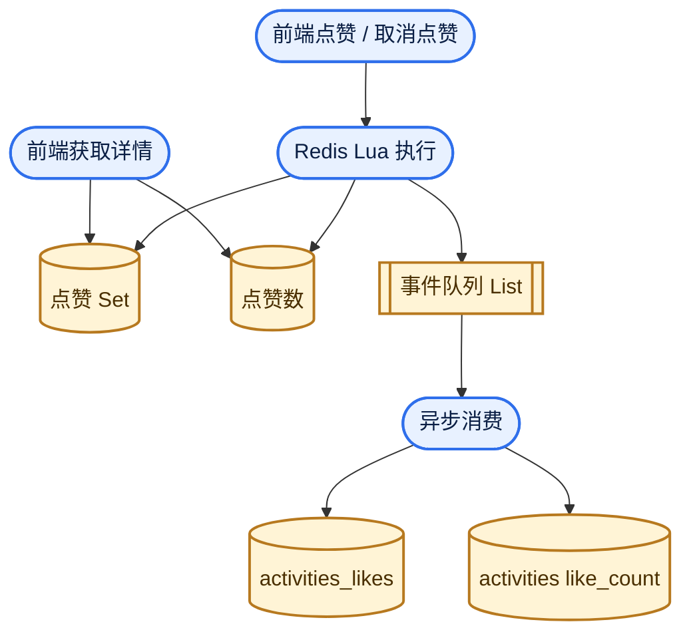

给某校开发中某系统做优化ing... 这个系统有给活动点赞的功能需求，考虑到点赞是高频写操作，所以采用了 `redis` 记录点赞数目，维护点赞用户集合，再使用 `redis` 的 `list` 作为简单的异步队列，进行点赞记录异步刷入数据库。



在这个流程里，如果 `lua` 脚本查询 `点赞set` 失败，将会回源数据库并尝试重建缓存，经过 `apifox` （你怎么被投毒了😭）测试，结果符合预期，于是我就提交、合并。

第二天，前端同学完成了这样的逻辑：点赞后立刻获取最新详情，发现：取消点赞接口可以正确返回该用户未点赞，而接着请求的最新详情中，返回的却是用户已点赞！！而且刷新再次请求后，仍然是已点赞！！我意识到，缓存被错误重建了。

我回想我手动测试与前端请求的不同：手动测试在两个请求之间间隔较大，而前端的请求逻辑间隔小。所以是因为前端请求过快，导致错误回源数据库并重建缓存。我进一步分析发现：业务逻辑中混淆了 “空集合” 和 “缓存未命中”！而前端测试的时候，只有一条点赞记录，导致出现了bug：最后一个点赞记录被删除，导致 `点赞set` 被清除，查询 `redis` 时误认为没有点赞记录的缓存，于是回源数据库，而此时异步删除点赞记录的任务还没生效！导致重建了错误的缓存，于是出现了这个bug。

更新维护 `点赞set` 的逻辑，成功修复bug：

```java
private static final DefaultRedisScript<String> ACTIVITY_UNLIKE_SCRIPT =
        new DefaultRedisScript<>(
                // 1) 检查用户是否在点赞集合里；并读取当前点赞数（没有则用兜底值 ARGV[4]）
                "local existed = redis.call('SISMEMBER', KEYS[1], ARGV[1]) " +
                "local count = tonumber(redis.call('GET', KEYS[2]) or ARGV[4]) " +

                // 2) 未点赞直接返回 MISS，避免重复取消导致脏写
                "if existed == 0 then return 'MISS:' .. count end " +

                // 3) 执行取消点赞
                "redis.call('SREM', KEYS[1], ARGV[1]) " +

                // 4) 若集合为空，补一个哨兵，避免后续 key 被动消失带来缓存穿透判断问题
                "if redis.call('SCARD', KEYS[1]) == 0 then redis.call('SADD', KEYS[1], ARGV[6]) end " +
                "redis.call('EXPIRE', KEYS[1], tonumber(ARGV[2])) " +

                // 5) 点赞数安全递减：大于 0 才 DECR；否则强制回写 0
                "if count > 0 then count = redis.call('DECR', KEYS[2]) else count = 0 redis.call('SET', KEYS[2], '0', 'EX', tonumber(ARGV[3])) end " +
                "redis.call('EXPIRE', KEYS[2], tonumber(ARGV[3])) " +

                // 6) 推送异步事件到队列，供后续落库
                "redis.call('LPUSH', KEYS[3], ARGV[5]) " +

                // 7) 返回成功及最新计数
                "return 'OK:' .. count",
                String.class);
```
