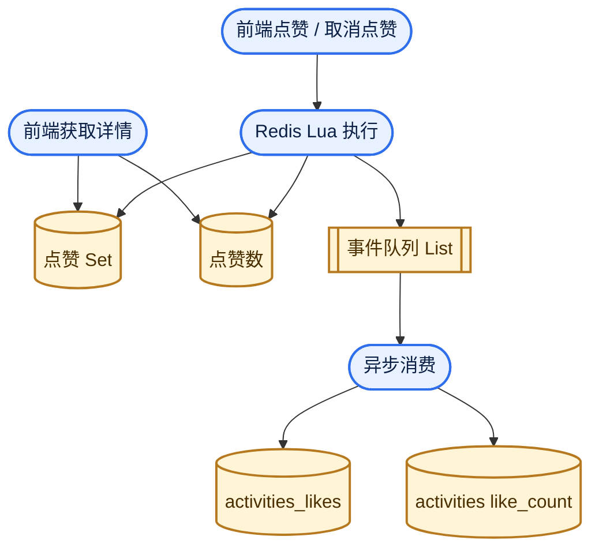

## 先说点赞这套缓存

给某校开发中的某系统做优化……这个系统有给活动点赞的功能需求。考虑到点赞是高频写操作，所以采用了 `Redis` 记录点赞数目，维护点赞用户集合，再使用 `Redis` 的 `List` 作为简单的异步队列，将点赞记录异步写入数据库。

## 这套流程长这样


```mermaid
flowchart TD
      A([前端点赞 / 取消点赞]) --> B([Redis Lua 执行])
      B --> C[(点赞 Set)]
      B --> D[(点赞数)]
      B --> E[[事件队列 List]]

      F([前端获取详情]) --> C
      F --> D

      E --> G([异步消费])
      G --> H[(activities_likes)]
      G --> I[(activities like_count)]

      classDef event fill:#E8F1FF,stroke:#2F6FEB,stroke-width:2px,color:#0B1F44;
      classDef data fill:#FFF4D6,stroke:#B7791F,stroke-width:2px,color:#4A2F00;

      class A,B,F,G event;
      class C,D,E,H,I data;

```

## 前端一点快，状态就乱了

在这个流程里，如果 `Lua` 脚本查询 `点赞 Set` 失败，将会回源数据库并尝试重建缓存。经过 `Apifox`（你怎么被投毒了😭）测试，结果符合预期，于是我就提交、合并。

第二天，前端同学完成了这样的逻辑：点赞后立刻获取最新详情。结果发现，取消点赞接口可以正确返回该用户未点赞，而紧接着请求的最新详情中，返回的却是用户已点赞！而且刷新后再次请求，结果仍然是已点赞！我意识到，缓存被错误重建了。

## 空集合和没缓存不是一回事

我回想手动测试与前端请求的不同：手动测试时两个请求之间的间隔较大，而前端的请求间隔很短。因此，前端请求过快时会错误地回源数据库并重建缓存。进一步分析后发现，业务逻辑混淆了“空集合”和“缓存未命中”。前端测试时只有一条点赞记录，最后一条记录被删除后，`点赞 Set` 也随之消失。查询 `Redis` 时，程序误以为点赞记录尚未缓存，于是回源数据库；但此时异步删除任务尚未生效，最终重建出了错误的缓存。

## 给空集合留个哨兵

更新 `点赞 Set` 的维护逻辑后，Bug 成功修复：

```java
private static final DefaultRedisScript<String> ACTIVITY_UNLIKE_SCRIPT =
        new DefaultRedisScript<>(
                // 1) 检查用户是否在点赞集合里；并读取当前点赞数（没有则用兜底值 ARGV[4]）
                "local existed = redis.call('SISMEMBER', KEYS[1], ARGV[1]) " +
                "local count = tonumber(redis.call('GET', KEYS[2]) or ARGV[4]) " +

                // 2) 未点赞直接返回 MISS，避免重复取消导致脏写
                "if existed == 0 then return 'MISS:' .. count end " +

                // 3) 执行取消点赞
                "redis.call('SREM', KEYS[1], ARGV[1]) " +

                // 4) 若集合为空，补一个哨兵，避免后续 key 被动消失带来缓存穿透判断问题
                "if redis.call('SCARD', KEYS[1]) == 0 then redis.call('SADD', KEYS[1], ARGV[6]) end " +
                "redis.call('EXPIRE', KEYS[1], tonumber(ARGV[2])) " +

                // 5) 点赞数安全递减：大于 0 才 DECR；否则强制回写 0
                "if count > 0 then count = redis.call('DECR', KEYS[2]) else count = 0 redis.call('SET', KEYS[2], '0', 'EX', tonumber(ARGV[3])) end " +
                "redis.call('EXPIRE', KEYS[2], tonumber(ARGV[3])) " +

                // 6) 推送异步事件到队列，供后续落库
                "redis.call('LPUSH', KEYS[3], ARGV[5]) " +

                // 7) 返回成功及最新计数
                "return 'OK:' .. count",
                String.class);
```
