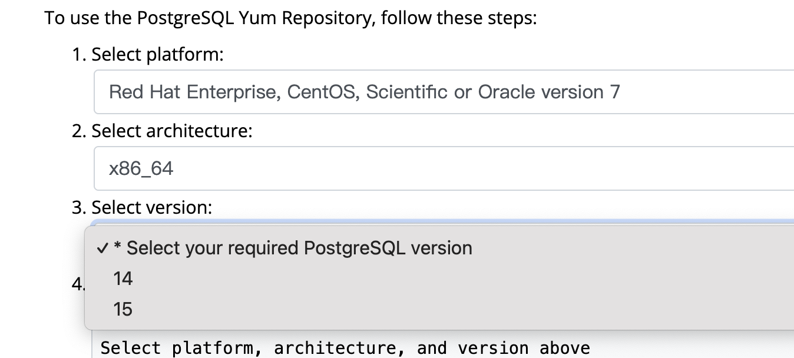

#### 讲讲这个老服务器

因为新项目甲方不想要走学校的（又臭又长的）流程，所以为了后续部署，我们开始搜罗手上的服务器，发现了4个远古服务器：

```bash
[root@service0 etc]# cat os-release 
NAME="Red Hat Enterprise Linux Server"
VERSION="7.4 (Maipo)"
ID="rhel"
ID_LIKE="fedora"
VARIANT="Server"
VARIANT_ID="server"
VERSION_ID="7.4"
PRETTY_NAME="Red Hat Enterprise Linux Server 7.4 (Maipo)"
ANSI_COLOR="0;31"
CPE_NAME="cpe:/o:redhat:enterprise_linux:7.4:GA:server"
HOME_URL="https://www.redhat.com/"
BUG_REPORT_URL="https://bugzilla.redhat.com/"

REDHAT_BUGZILLA_PRODUCT="Red Hat Enterprise Linux 7"
REDHAT_BUGZILLA_PRODUCT_VERSION=7.4
REDHAT_SUPPORT_PRODUCT="Red Hat Enterprise Linux"
REDHAT_SUPPORT_PRODUCT_VERSION="7.4"
```

古老的 `RHEL7`（这系统发布的时候我还在玩泥巴)，但是我们使用的中间件 ———— `Postgresql` 和 `Redis` 分别是 `18` 和 `7.0`，不支持这么古老的系统。看看这个PostgreSQL:



#### 本地环境准备


**1. 启动 CentOS 7 构建容器**

由于我的设备是 `Windows`，所以采用 `Docker` 拉取 `CentOS7` 镜像（因为同属红帽系），并进入镜像进行构建：

```bash
docker run -it --rm centos:7 bash
```

**2. 修复 CentOS 7 yum 源**

CentOS 7 已 EOL，默认源不可用，需要切换到 Vault 源：

```bash
cat > /etc/yum.repos.d/CentOS-Base.repo <<'EOF'
[base]
name=CentOS-7.9.2009 - Base
baseurl=http://vault.centos.org/7.9.2009/os/$basearch/
enabled=1
gpgcheck=0

[updates]
name=CentOS-7.9.2009 - Updates
baseurl=http://vault.centos.org/7.9.2009/updates/$basearch/
enabled=1
gpgcheck=0

[extras]
name=CentOS-7.9.2009 - Extras
baseurl=http://vault.centos.org/7.9.2009/extras/$basearch/
enabled=1
gpgcheck=0
EOF

yum clean all
yum makecache
```

**3. 安装通用编译依赖**

```bash
yum install -y wget gcc make perl tar readline-devel zlib-devel bison flex
```

#### 开始构建

**1. 编译PostgreSQL 18**

```bash
cd /usr/local/src

wget https://ftp.postgresql.org/pub/source/v18.0/postgresql-18.0.tar.gz

tar -zxvf postgresql-18.0.tar.gz
cd postgresql-18.0
```

**2. 编译、安装 PostgreSQL 并检查版本**

```bash
make -j$(nproc)

make install

/usr/local/pgsql18/bin/postgres --version
/usr/local/pgsql18/bin/psql --version
```

**3. 打包 PostgreSQL 编译产物并上传**

在 `Docker` 容器中打包

```bash
cd /usr/local
tar -czvf /tmp/pgsql18-centos7-build.tar.gz pgsql18
```

在宿主机导出

```bash
docker ps
docker cp 容器ID:/tmp/pgsql18-centos7-build.tar.gz .
```

**4. 在 RHEL7 的离线服务器上部署**

解压并验证版本

```bash
cd /usr/local
tar -zxvf pgsql18-centos7-build.tar.gz

/usr/local/pgsql18/bin/postgres --version
```

创建用户和数据目录并初始化数据库

```bash
id postgres || useradd postgres

mkdir -p /data/pgsql18
chown -R postgres:postgres /data/pgsql18

su - postgres
/usr/local/pgsql18/bin/initdb -D /data/pgsql18
exit
```

配置 PostgreSQL systemd 服务

```bash
cat > /etc/systemd/system/postgresql-18.service <<'EOF'
[Unit]
Description=PostgreSQL 18 database server
After=network.target

[Service]
Type=forking
User=postgres
Group=postgres
Environment=PGDATA=/data/pgsql18
ExecStart=/usr/local/pgsql18/bin/pg_ctl start -D ${PGDATA} -s -w -t 300
ExecStop=/usr/local/pgsql18/bin/pg_ctl stop -D ${PGDATA} -s -m fast
ExecReload=/usr/local/pgsql18/bin/pg_ctl reload -D ${PGDATA} -s
TimeoutSec=300

[Install]
WantedBy=multi-user.target
EOF
```

启动

```bash
systemctl daemon-reload
systemctl enable --now postgresql-18
systemctl status postgresql-18

ss -lntp | grep 5432
```

**5. 编译 Redis7.0.15 源码**

```bash
cd /usr/local/src

wget https://download.redis.io/releases/redis-7.0.15.tar.gz

tar -zxvf redis-7.0.15.tar.gz
cd redis-7.0.15

make distclean
make -j$(nproc) MALLOC=libc

src/redis-server --version
src/redis-cli --version
```

**6. 整理 Redis 安装目录**

```bash
mkdir -p /usr/local/redis7/{bin,etc,data,log,run}

cp src/redis-server /usr/local/redis7/bin/
cp src/redis-cli /usr/local/redis7/bin/
cp src/redis-benchmark /usr/local/redis7/bin/
cp src/redis-check-aof /usr/local/redis7/bin/
cp src/redis-check-rdb /usr/local/redis7/bin/

cp redis.conf /usr/local/redis7/etc/redis.conf
```

修改基础配置

```bash
sed -i 's/^bind 127.0.0.1 -::1/bind 127.0.0.1/' /usr/local/redis7/etc/redis.conf
sed -i 's/^daemonize no/daemonize no/' /usr/local/redis7/etc/redis.conf
sed -i 's|^dir ./|dir /usr/local/redis7/data|' /usr/local/redis7/etc/redis.conf
sed -i 's|^logfile ""|logfile "/usr/local/redis7/log/redis.log"|' /usr/local/redis7/etc/redis.conf
sed -i 's|^pidfile /var/run/redis_6379.pid|pidfile /usr/local/redis7/run/redis_6379.pid|' /usr/local/redis7/etc/redis.conf
```

**7. 打包 Redis 构建产物并上传**

在 `Docker` 容器中打包

```bash
cd /usr/local
tar -czvf /tmp/redis7-centos7-build.tar.gz redis7
```

在宿主机导出

```bash
docker ps
docker cp 容器ID:/tmp/redis7-centos7-build.tar.gz .
```

**8. 在 RHEL7 的离线服务器上部署**

```bash
cd /usr/local
tar -zxvf redis7-centos7-build.tar.gz

/usr/local/redis7/bin/redis-server --version
/usr/local/redis7/bin/redis-cli --version
```

创建用户并授权

```bash
id redis || useradd -r -s /sbin/nologin redis

chown -R redis:redis /usr/local/redis7
```

配置 Redis systemd 服务

```bash
cat > /etc/systemd/system/redis7.service <<'EOF'
[Unit]
Description=Redis 7.0 Server
After=network.target

[Service]
Type=simple
User=redis
Group=redis
ExecStart=/usr/local/redis7/bin/redis-server /usr/local/redis7/etc/redis.conf
ExecStop=/usr/local/redis7/bin/redis-cli -h 127.0.0.1 -p 6379 shutdown
Restart=always
RestartSec=3
LimitNOFILE=100000

[Install]
WantedBy=multi-user.target
EOF
```

启动

```bash
systemctl daemon-reload
systemctl enable --now redis7
systemctl status redis7
```

测试

```bash
ss -lntp | grep 6379

/usr/local/redis7/bin/redis-cli -h 127.0.0.1 -p 6379 ping
```

#### 总结

总的来说，可以这样总结：

离线服务器无法访问外网，且 RHEL7 系统较老，不适合强装新版 RPM。

因此选择在本地 Docker 中使用 CentOS 7 构建环境，提前编译 PostgreSQL 18 和 Redis 7.0，再将编译产物打包上传到服务器，通过 systemd 管理服务。
