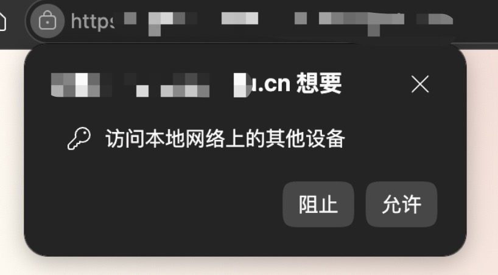
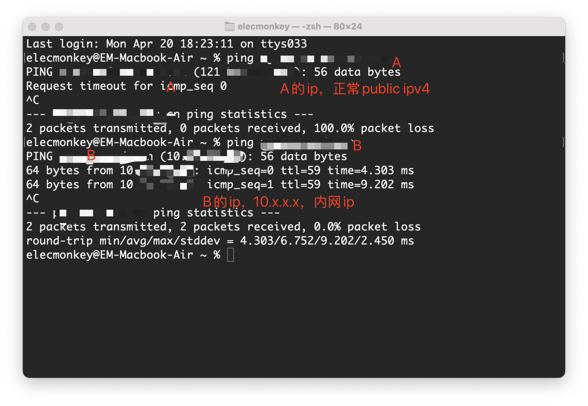

## PNA 引发的问题

### 上线初期：有提示，但不影响使用

事情还要从一个诡异的 Bug 说起。在部署某个临时的内网业务系统的时候，出于掌握的计算资源的限制，选择把前端部署在了 A 域名的子路径下，后端部署在了 B 域名的子路径下。由于 A、B 两业务均为内网访问，按理来说就是在内网环境则二者均可达，不在内网环境二者均不可达，故自始至终没有多想。

上线之后，我曾短暂留意过，在从登录入口跳转进入该系统的前端的时候，会出现如下的提示：

虽然我并不理解原因，但我当时也没有多想，这个提示并不影响正常使用，登录之后的业务页面也没有任何问题。

### 一周后：部分用户接口全部失败

上线一周之后，有同学反馈自己无论如何刷新系统都不正常，所有接口 Failed to fetch，网络选项卡的请求信息显示 CORS 错误，控制台打印了有关 Private Network Access 的错误信息。这个既然开发的时候做的决策就是跨域部署，后端肯定是给了正确的 CORS 的响应头的。于是我被迫去关注这个我没有听说过的问题，PNA。

## 为什么这个拓扑会触发 PNA

### A 看起来是内网系统，但在浏览器视角是"公网地址"

简单来说，A 是一个历史比较悠久的系统，学校网信部门曾经是开放过外网访问的，随着这几年安全策略变严格，外网访问被停掉了。但是大概是出于不破坏既有系统运转的考虑，A 域名在内网 DNS 解析到的结果仍然是原来的那个外部 IP，也就是说，A 的【仅内网访问】不是网络拓扑先天决定的，大抵是防火墙某一步做了流量拦截和过滤。

### B 是典型内网主机

B 一开始就是一个内网服务器，领着内网 IPv4。然后在这个场景下，浏览器就会认为 A 是一个公网地址，B 是一个内网地址，A 访问 B 就是一个跨公网访问内网的场景了。根据 Chrome 的 PNA 机制，A 访问 B 就会被默认禁止了。

## CORS 方案为什么在这里不稳定

### 理论上的方案：加 `Access-Control-Allow-Private-Network`

AI 给出的一个解决办法是请 Nginx 来给所有 OPTIONS 都加上 `Access-Control-Allow-Private-Network: true`。

### 实际遇到的情况：Chrome 直接弹用户授权

但是很可惜我的 Chrome 似乎根本不会在这个场景下发预检请求，而是弹了个框请求用户授权。外网的源拉下来的脚本请求内网的主机地址，这个过程存在安全风险，这没问题。但是如果想避免安全风险，应该征求谁的同意，用户的还是目标服务器的？

至少按照历史上 Chrome 的安全策略设计原则来看，Chrome 官方显然没觉得用户是有判断力的。如果目标服务器认为自己【有意被设计为】可以被外部源发送请求，或者可以被某些特定的外部源发送请求，【我想】就不应该再认为这个过程是有安全风险的。至于这个"某些特定的外部源"——现在是通过 CORS 协议来实现的。如果必须要通过一个方式在 PNA 的情形下争取目标服务器的同意，在现有的 CORS 协议的基础上增补字段是一个显然的最优选择。

## Chrome 的 PNA/LNA 机制演变

- Chrome 在 PNA 早期（Chrome 94–123）采用基于 CORS 的服务器授权模型，通过 Access-Control-Allow-Private-Network 控制访问；
- 在 Chrome 124–141 过渡阶段引入用户权限提示；
- 自 Chrome 142 起正式转向 Local Network Access（LNA）模型，改为以用户授权为核心，不再依赖预检请求，因此服务端无法通过简单增加 CORS 头部来解决问题。

但是的但是，Chrome 最终选择了用户授权模式，不再依赖预检请求。这个问题很尴尬了，很显然我在看到"访问本地网络上的其它设备"都看的一头雾水不知所以然，我只能向遇到问题的用户强调【遇到弹窗麻烦点允许】，至于说已经给拒绝掉的，不知道，换浏览器吧。经测试微信好像不拦截。
